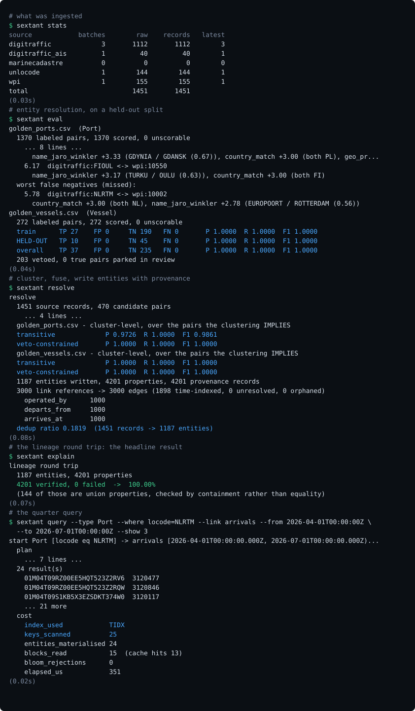

# Sextant

**A mini-Foundry: ontology, entity resolution and cell-level lineage over a
from-scratch LSM storage engine.**

> Sextant ingests maritime data from three heterogeneous sources, maps it onto a
> declarative ontology, resolves duplicate real-world entities across sources,
> and records - for every single property value - the exact source row and
> transform chain that produced it.

*A sextant fixes your position by combining several independent observations.
That is literally entity resolution.*

C++20 · React · no storage dependencies

> **Provenance.** The storage engine is a **reimplementation of LevelDB's
> design**, not an original one. The record format, internal key layout,
> version and MANIFEST scheme and compaction picker are all Google's; the
> skiplist is close to a port. What is mine is the twelve-keyspace ontology
> layer on top, the resolver, the lineage model and the query planner - and the
> decision to rebuild the engine underneath rather than link RocksDB, which is
> [ADR 0001](docs/adr/0001-lsm-over-btree.md). Reimplementing a known-good
> design is a good way to learn one; it is not the same as inventing it.

```bash
git clone https://github.com/AadityaK21/sextant && cd sextant && make demo
```

Builds, ingests the committed corpus, resolves entities, verifies every value
against its source row, and serves the API and UI on
**[localhost:8080](http://localhost:8080)**. No network, no credentials, no
downloads - small excerpts of every source are in the repository.



*Generated by `python3 scripts/record_demo.py` from a real run against a real
database. It is regenerated rather than recorded, so the numbers in it cannot
drift from the code.*

### The one number that matters

```
lineage round trip
  1187 entities, 4201 properties
  4201 verified, 0 failed  ->  100.00%
```

For every property of every entity: read the provenance, fetch the raw source
row it names, re-apply the transform chain by id, assert the result equals the
stored value. Lineage that is not verified is a comment; this makes it an
invariant. It has a negative control, because a check that cannot fail is not a
check.

---

## Status

| Milestone | | |
|---|---|---|
| **Day 1** - memtable, WAL, recovery, snapshots | ✅ | 67 tests green |
| **Day 2** - SSTable build/read, flush to L0 | ✅ | 98 tests green |
| **Day 3** - bloom filters, block cache, merging iterator | ✅ | 132 tests green |
| **Day 4** - VersionSet/MANIFEST, leveled compaction | ✅ | 145 tests green |
| **Day 5** - keyspace codec, ULID, ordered encodings | ✅ | 209 tests green |
| **Days 6-7** - ontology, transforms, three connectors | ✅ | 314 tests green |
| **Day 8** - normalization, blocking, RR/PC | ✅ | 350 tests green |
| **Days 9-10** - scoring, clustering, fusion | ✅ | 370 tests green |
| **Day 11** - link resolution, lineage, round-trip test | ✅ | 376 tests green |
| **Day 12** - query planner, executor, cost accounting, HTTP API | ✅ | 410 tests green |
| **Days 13-14** - React frontend, lineage drawer, link graph, review queue | ✅ | 413 tests green |
| **Day 15** - one-command demo, ADRs, crash test, 10⁶-op differential | ✅ | 415 tests green |
| **Post-review** - iterator refcount race, TSan build, honest scope claims | ✅ | 418 tests green |

What each milestone produced, and where the implementation departed from the
design: [`docs/STATUS.md`](docs/STATUS.md).

---

## Build

```bash
cmake -B build -DCMAKE_BUILD_TYPE=RelWithDebInfo
cmake --build build -j
ctest --test-dir build --output-on-failure
```

The same three lines work in PowerShell. Do not join them with `&&` there -
Windows PowerShell 5 does not have it.

Dependencies are fetched and version-pinned at configure time - nothing to
install. Requires CMake ≥ 3.20 and a C++20 compiler. Postgres is optional: if
`libpq` is absent the SQL connector is stubbed and everything else still builds.

```bash
./build/bench/lsm_bench 200000 100      # benchmarks
```

## Run it

Small excerpts of every source are committed, so this works on a fresh clone
with no network and no downloads.

```bash
./build/src/cli/sextant schema                      # the ontology, validated
./build/src/cli/sextant ingest --source wpi         # NGA World Port Index (CSV)
./build/src/cli/sextant ingest --source unlocode    # UN/LOCODE (CSV)
./build/src/cli/sextant ingest --source digitraffic # Digitraffic (REST/JSON)
./build/src/cli/sextant ingest --source digitraffic_ais
./build/src/cli/sextant stats
./build/src/cli/sextant block                       # blocking + RR/PC report
./build/src/cli/sextant eval                        # precision, recall, F1
./build/src/cli/sextant resolve                     # cluster, fuse, write entities
./build/src/cli/sextant explain                     # the lineage round-trip
./build/src/cli/sextant query --type Port --where locode=NLRTM \
    --link arrivals --from 2026-04-01T00:00:00Z --to 2026-07-01T00:00:00Z
./build/src/cli/sextant serve                       # the query API on :8080
```

The frontend is a separate step, and one binary serves both:

```bash
cd web && npm install && npm run build && cd ..
./build/src/cli/sextant serve --static web/dist     # app and API on :8080
```

For frontend work, `npm run dev` runs Vite on :5173 and proxies `/api` to the
binary, so both hot-reload independently.

```
lineage round trip
  1187 entities, 4201 properties
  4201 verified, 0 failed  ->  100.00%
```

`query` prints the plan, the answer and what it cost. The plan is a value the
engine returns, not a log line, so the same text appears on every API response:

```
  plan
1. resolve start set of Port
     via IDX (IDX)
     IDX on Port.locode serves locode eq NLRTM as a key range; the property is
     unique-hinted, so this is expected to be one entity
2. hop 1: Port <- arrives_at -> Voyage
     via TIDX (TIDX)
     the hop has a time predicate and 'arrives_at' carries a time_index on
     arrived_at, so TIDX turns the window into one contiguous range: seek to
     the start and read forward, with no candidate examined and rejected
     window [2026-04-01T00:00:00.000Z, 2026-07-01T00:00:00.000Z)

  24 result(s)

  cost
    index_used            TIDX
    keys_scanned          25
    entities_materialised 24
    blocks_read           18  (cache hits 16)
    elapsed_us            359
```

On Windows, MSVC is a multi-config generator, so the binary lands one directory
deeper. Run these from the repository root - the schema and data paths are
relative to it:

```powershell
$sx = (Get-ChildItem -Recurse build -Filter sextant.exe)[0].FullName
& $sx schema
& $sx ingest --source wpi
& $sx stats
```

```
ingest unlocode (csv)
  data/snapshots/unlocode/code-list.csv batch 1  17 rows -> 15 records,
  90 values (0 rejected, 2 filtered) in 0 ms

source            batches        raw    records   latest
digitraffic             3         27         27        3
unlocode                1         15         15        1
wpi                     1         12         12        1
```

Run the same ingest twice and the second one does nothing - the input
fingerprint has not changed. Then follow a value back to the bytes it came from:

```bash
./build/src/cli/sextant lineage --source unlocode --batch 1 --row 9
# RAW unlocode batch 1 row 9
# ,SE,GOT,Göteborg,Goteborg,14,AI,1234----,0401,GOT,5742N 01156E,
```

`./data/fetch.sh all` replaces the excerpts with the full datasets.

---

## The idea that holds it together

Most projects in this shape become seven disconnected demos. Sextant is one
system because of a single decision:

> **The LSM engine provides an ordered key-value store with prefix scan.
> Every layer above it is a key encoding.**

Entities, links, provenance, secondary indexes, blocking indexes and raw records
are all bytes in one keyspace, laid out so the access pattern each one needs is
a *sequential range scan*.

Graph traversal is not a subsystem - it is a prefix scan over
`LINKOUT ‖ entity ‖ link_type`. "All voyages through this port last quarter" is
not a filter - it is a range scan over a big-endian timestamp suffix
(see [ADR 0002](docs/adr/0002-big-endian-key-encoding.md)).

```
   web/            React - type browser · lineage drawer · link graph · review   built
   src/api/        HTTP routes · JSON · CORS · snapshot per request   built
   src/query/      planner · index selection · executor · cost        built
   src/lineage/    provenance reader · round-trip verification  built
   src/resolve/    normalize · block · score · cluster · fuse · link   built
   src/cli/        ingest · stats · block · eval · resolve · lineage · query · serve  built
   src/connectors/ CSV · REST/JSON · Postgres                   built
   src/ontology/   declarative types, links and transforms      built
   src/codec/      key encoding - the glue                      built
   src/lsm/        WAL · MemTable · SSTable · Compaction        built
```

Every directory in that diagram exists and is tested. The architecture document
describes the design; [`docs/STATUS.md`](docs/STATUS.md) records what was
actually built, what it measured, and the places the two differ.

Full design: [`docs/ARCHITECTURE.md`](docs/ARCHITECTURE.md).

---

## Data sources

All free, all open, all genuinely messy - the duplication is real, not seeded.

| Connector | Source | What it contributes |
|---|---|---|
| **CSV** | [UN/LOCODE](https://unece.org/trade/uncefact/unlocode) (UNECE), [NGA World Port Index](https://msi.nga.mil/Publications/WPI) | The code authority vs. the geographic authority. Diacritics, degree-minute coordinates, `ALL CAPS` names, patchy code coverage. |
| **REST/JSON** | [Fintraffic Digitraffic](https://www.digitraffic.fi/en/marine-traffic/) | Port calls - which *are* the `Voyage` entity, with arrival/departure links already implied. Plus AIS positions and a vessel registry. |
| **Postgres** | [MarineCadastre.gov AIS](https://hub.marinecadastre.gov/datasets/vessel-traffic-ais-1) (NOAA + BOEM + USCG) | MMSI-keyed rows with mostly no IMO, a different vessel-type taxonomy, US naming conventions. |

```bash
./data/fetch.sh all
```

---

## Results

Every number here is reproducible with a command. Before any of them:

> **What these numbers are, and what they are not.**
>
> The storage figures are **microbenchmarks on synthetic keys, on one machine**.
> 1.53M writes/sec means one process writing 100-byte values into a warm page
> cache with `sync=false`. It is a useful number for comparing this engine
> against itself across milestones - which is what it was built for, and why the
> read regression when SSTables landed is recorded next to its recovery. It is
> **not a scale story**, and it says nothing about behaviour on a working set
> that does not fit in RAM, under concurrent load, or on real hardware with a
> real I/O queue. None of those have been measured.
>
> The entity-resolution figures come from a **generated corpus with ground truth
> by construction** - each record carries a hidden truth id, and the golden set
> is derived from it rather than hand-labeled by a domain expert. That is a real
> evaluation of whether the resolver recovers identity from noisy attributes,
> and it is not evidence about a messy production dataset whose duplicates were
> not designed. [`docs/ER.md §1`](docs/ER.md) sets out exactly what it does and
> does not establish, and §9 lists the limitations.
>
> The largest corpus this has run on is **1,451 source records**.

**Read the conditions before the numbers.** All storage figures below come from
one command - `./build/bench/lsm_bench 200000 100` - on **one machine**: a Linux
container, GCC 11.4, 200,000 entries, 100-byte values, 4 MB write buffer,
1,000 keys per batch, `sync=false`. Change any of those and the numbers move,
sometimes by an order of magnitude. [`docs/BENCH.md`](docs/BENCH.md) has the
full table including a second platform, and says which differences are the
engine and which are the environment.

The most important caveat: **`sync=false` is not a durability claim.** With
`fsync` on every write the same engine does 655 ops/sec in that container,
because an fsync is a device round-trip and no amount of CPU work touches it.
That number is in `BENCH.md` too, and it is the one to quote if anyone asks
what the engine does when durability is actually required.

| | |
|---|---|
| Storage engine | 1.53M batched writes/sec · 494k random writes/sec · 3.7M misses/sec · write amplification **1.20x** |
| | 655 writes/sec with `sync=true` - the fsync floor, quoted so the batched number is not read as a durability figure |
| | Recovery bounded by buffer size, not data size: 2,013 records replayed instead of 202,200 |
| Correctness | 413 tests green on Linux, Windows and macOS · clean under ASan + UBSan · lock-free skiplist clean under ThreadSanitizer |
| | Differential test: 60k random ops vs `std::map`, forced across ~40 flushes and many SSTables |
| | Torn-WAL recovery: every acknowledged write survives a truncated log tail |
| | Block and SSTable CRCs reject single-bit corruption |
| | Bloom filter proven to have zero false negatives over 10k keys |
| | Leveled compaction: read amplification stays bounded as data grows 10x |
| | Iterators survive concurrent compaction deleting the files they read |
| Keyspace codec | Byte order proven to equal logical order for strings, signed ints and doubles |
| | The quarter-query verified to touch exactly the matching keys - a range scan, not a filter |
| Ontology | 21 transforms, each asserted pure: same chain, same input, same answer, every time |
| | Transform ids pinned by test, because they are written into provenance records forever |
| | Adding an entity type is a YAML edit - the loader rejects 14 classes of schema mistake at startup |
| Connectors | CSV, REST/JSON and Postgres behind one `RowSource` interface, all three streaming |
| | Re-ingesting an unchanged input is a verified no-op; a changed one never destroys the old batch |
| | Every stored value replays from its recorded transform chain and raw cell - the day 11 test in miniature |
| Blocking | Reduction ratio **0.993**, pair completeness **0.997** on 1,370 labeled port pairs, **1.000** on 272 vessel pairs · [methodology](docs/ER.md) |
| | Per-key attribution measured, and it found one of the five keys contributing **zero** unique recall - written up rather than quietly dropped |
| Entity resolution | **F1 0.991** on a held-out split the weights were never fitted to (266 port pairs) · 1.000 on vessels · [methodology](docs/ER.md) |
| | Veto-constrained clustering measured against plain union-find: precision **1.000 vs 0.973**, 10 merges refused |
| | Three pairs where the MMSI matches exactly and the answer is still no - an IMO conflict is a rule, not a weight to be outvoted |
| | 451 port and vessel records resolve to 187 entities, **58% of records merged away**, every property carrying provenance with its rejected alternatives |
| | Across the whole corpus 1,451 records become 1,187 entities. The 1,000 voyages are 1:1 by construction, so quoting the combined ratio as a resolution result would be flattering the number with rows that were never duplicates |
| Lineage | **Round-trip verified for 100% of 4,201 resolved properties** across 1,187 entities - read the provenance, fetch the raw row, replay the chain, assert equality |
| | The round trip has a negative control: corrupt a provenance record and it must go red, because a checker that cannot fail is not a check |
| | "Why does this say Rotterdam?" is two point lookups, both O(log n) - no scan, no join, no separate lineage store |
| | The quarter-query over resolved data: **24 arrivals returned, 24 keys scanned** - a range scan, not a filter |
| Query engine | **410 tests green**, clean under ASan + UBSan · the planner names its access path and its reason on every step |
| | The quarter query end to end over HTTP: **24 arrivals, 24 keys scanned, `index_used: "TIDX"`, 230 us** |
| | The index and the full scan are asserted to return **the same 24 voyages** out of 92 arrivals - the index is an optimisation, not a filter that quietly drops rows |
| | Cost comes from a `ReadStats` the request owns, threaded into the storage engine, so it is this query's cost even with a compaction running underneath |
| | An indexed lookup reads **1 key** where the equivalent scan reads 144 |
| | The plan's warning found a real schema gap on its first run: the search box had no index behind it |
| Frontend | Vite + React + TypeScript, **no entity type or property named anywhere in the code** - the only occurrences in `web/src` are comments explaining that fact. Add a type to the YAML and it appears with its properties, links and lineage |
| | The lineage drawer: raw row with the source column highlighted, the transform chain as pills, the fusion rule, what lost and why, and the replay verdict recomputed on every open |
| | Force-directed link graph in ~120 lines of plain SVG, no graph library |
| | `npm run check:api` walks a live server and asserts every field the frontend relies on exists and is the declared kind - **162 field checks**, the join `tsc` cannot verify |

### The result that matters most

> **Lineage round-trip property test.** For every property of every entity: read
> the provenance, fetch the raw source row it names, re-apply the transform
> chain by ID, and assert the result equals the stored value.

Lineage that isn't verified is a comment. This makes it an invariant.

**It passes at 100% over 4,201 properties**, and it has a negative control:
`TheRoundTripDetectsACorruptedProvenanceRecord` rewrites a stored provenance
record to name a row that does not exist and asserts the check goes red. A
round trip that cannot fail would look exactly like a perfect one.

```
$ sextant explain --entity 01M02TVE9E2CDS4ZT8EQ3NGVQ4 --type Port

name = Rotterdam
  rule       most_trusted (confidence 0.95)
  origin     unlocode batch 1 row 2, column NameWoDiacritics
  raw cell   "Rotterdam"
  chain      trim -> collapse_ws -> title_case
  replay     "Rotterdam"  MATCHES
  rejected
    "ROTTERDAM" from source 1 row 1 (Main Port Name)
      lower source trust (0.80 < 0.95)
```

### Every response says what it cost

```
$ curl -s localhost:8080/api/traverse -d @quarter.json | jq '._stats'
{
  "index_used": "TIDX",
  "keys_scanned": 24,
  "entities_materialised": 24,
  "blocks_read": 13,
  "block_cache_hits": 16,
  "bloom_rejections": 0,
  "sstables_probed": 24,
  "elapsed_us": 230
}
```

Those numbers are not the executor's arithmetic. Each read carries a
`ReadStats` that the storage engine increments as it goes, so `blocks_read`
counts blocks the table layer actually pulled off disk and `keys_scanned`
counts entries the iterators actually stepped over.

The first version diffed the process-wide `Stats` before and after. It was
correct on one thread and wrong the moment a second request or a background
compaction moved the same counters - which is the worst kind of bug, because it
does not show up in the test that made you confident.

The claim `keys_scanned: 24` for 24 results is the kind that deserves a second
opinion, so there is a test that gets one: the same
window resolved through the time index and through a full adjacency scan is
asserted to return **the same 24 voyages** out of 92 total arrivals. An
off-by-one bound would return a plausible number of rows quickly and pass every
test that only looks at speed.

---

## What this deliberately does not do

Stated up front, because knowing what you didn't build is part of the design.

- **No distribution.** Single node.
- **No ML-based resolution.** A hand-tuned Fellegi-Sunter-style scorer is
  interpretable and tunable on 500 labels; a learned model needs 10⁵ and gives
  worse lineage.
- **No cross-entity transactions.** `WriteBatch` gives per-merge atomicity.
- **No incremental re-resolution.** Re-ingest triggers a full re-resolve.
  Incremental ER - especially cluster *splits* - is genuinely a research
  problem.
- **No auth or multi-tenancy.**

---

## Documentation

| | |
|---|---|
| [`docs/ARCHITECTURE.md`](docs/ARCHITECTURE.md) | Full design: keyspaces, LSM internals, ER algorithm, lineage model, query API |
| [`docs/STATUS.md`](docs/STATUS.md) | What is built, what it measured, and where the code departed from the design |
| [`docs/BENCH.md`](docs/BENCH.md) | Benchmarks and what they mean |
| [`docs/ER.md`](docs/ER.md) | Entity resolution: golden-set methodology, blocking results, what the numbers do and do not prove |
| [`docs/BUGS.md`](docs/BUGS.md) | Every bug worth writing down, with what it cost and what it taught |
| [`docs/adr/`](docs/adr/) | Architecture decision records |

### The decisions worth arguing about

| | |
|---|---|
| [ADR 0001](docs/adr/0001-lsm-over-btree.md) | LSM tree rather than a B-tree, framed as the RUM conjecture |
| [ADR 0002](docs/adr/0002-big-endian-key-encoding.md) | Big-endian keys, so byte order equals logical order |
| [ADR 0003](docs/adr/0003-snapshot-first-connectors.md) | Snapshot-first connectors, so a demo never depends on someone's uptime |
| [ADR 0004](docs/adr/0004-leveled-over-tiered-compaction.md) | Leveled over size-tiered compaction, and what it costs in write amplification |
| [ADR 0005](docs/adr/0005-veto-constrained-clustering.md) | Veto-constrained union-find, with the precision numbers for both |
| [ADR 0006](docs/adr/0006-bidirectional-link-storage.md) | Every link stored twice, and why both writes must be one batch |
| [ADR 0007](docs/adr/0007-cell-level-lineage.md) | Cell-level lineage verified by replay, rather than a DAG of boxes |

### Five bugs worth reading

The full log is [`docs/BUGS.md`](docs/BUGS.md). These five are the ones that
say something:

- **[An iterator released its refcounts without the mutex.](docs/BUGS.md)** The
  cleanup that drops a pinned Version runs on the iterator's thread, with no
  lock. Three races in one, including `~Version` unlinking itself from a shared
  list. TSan gives 51 warnings and two use-after-frees on the unfixed code; 418
  tests, ASan and UBSan all said nothing, because none of them ran the
  background thread.
- **[The negative control that did not fail.](docs/BUGS.md)** Breaking a
  transform left the round trip at 100%, which looked like the checker doing
  nothing. It was not: fusion picks the source whose column is already in that
  form. Breaking a different transform produced 144 failures.
- **[Records that were never compared were never created.](docs/BUGS.md)**
  Clustering was seeded from candidate pairs, so Voyages - which produce no
  blocking keys - never became entities. The graph was empty, and 459 records
  becoming 187 entities looks exactly like heavy merging.
- **[Running resolve twice doubled the entire graph.](docs/BUGS.md)** Entity ids
  are fresh ULIDs, so a second run wrote a complete second copy. Every count was
  individually plausible; only a ratio between two derived numbers went
  negative, and only because something checked.
- **[The search box had no index behind it.](docs/BUGS.md)** Nothing failed. The
  query planner simply said `full scan of Port: no usable index for name` on its
  first run, which is the entire argument for putting the plan on the response.

## Licence

MIT
